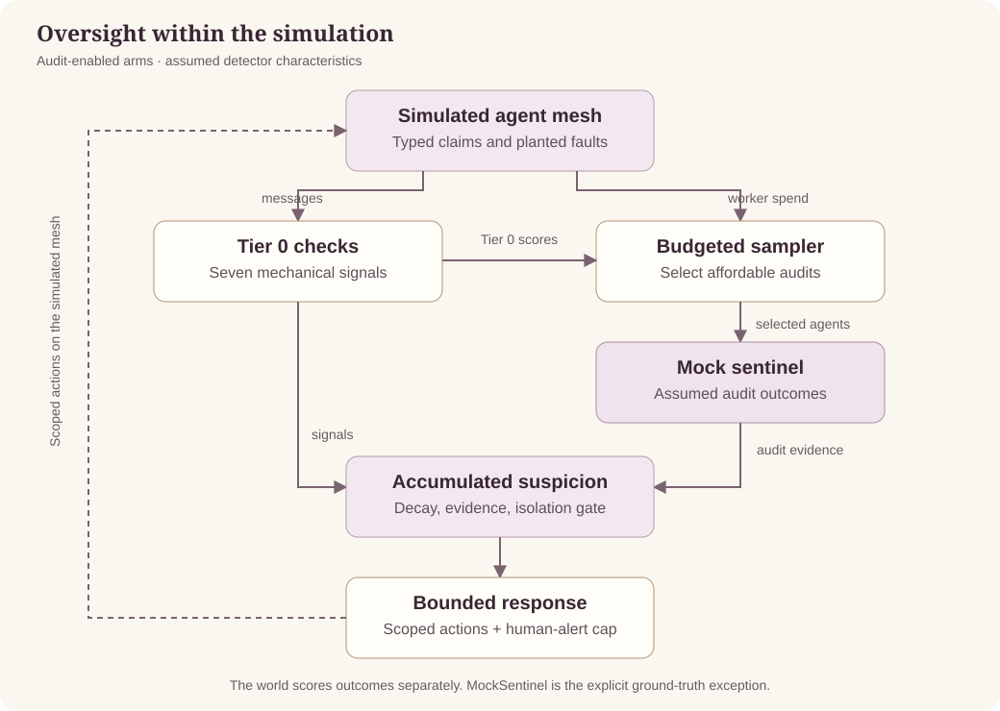

<p align="center">
  
</p>

# HARPY-SIM

**How much agent oversight can a system afford, and what detection capability would make it worthwhile?**

HARPY-SIM is a reproducible Python simulation of budgeted oversight for multi-agent systems. It compares inexpensive mechanical checks with selective sentinel audits, then accounts for detection, false isolations, discarded work, reruns, and human review.

[](https://github.com/MeLinResearch/Harpy/actions/workflows/ci.yml)
**Python 3.11+** · **MIT** · **Phase 1: simulation**

[Architecture](docs/ARCHITECTURE.md) · [Methodology](docs/METHODOLOGY.md) · [Run and inspect](docs/RUNNING.md)

## What this is

A simulated agent mesh exchanges typed claims. One agent develops a fault, and corrupted claims can propagate through their derivation chains. HARPY compares five oversight policies under the same simulated conditions.

| Question | What the simulation examines |
| --- | --- |
| Where should audits go? | Random, signal-directed, and hybrid sampling against two baseline arms. |
| What does oversight cost? | Six separate cost components, including human triage and investigation. |
| How much attention is available? | A human-alert cap that binds independently of the dollar budget. |
| How reliable is provenance? | A lossy lineage projection with missing and spurious edges. |

The output is a set of per-run JSON records and comparative figures. A sweep also writes a Parquet summary. Results are conditional on the supplied detector characteristics, pricing, and fleet scale.

## How it works



1. **Observe:** seven Tier 0 checks inspect typed fields and mechanical signals.
2. **Allocate:** the sampler buys audits from an allowance tied to worker spend.
3. **Accumulate:** decaying suspicion combines Tier 0 signals with audit outcomes.
4. **Respond:** the controller exposes five scoped actions; human alerts have their own cap.
5. **Score:** the simulation records detection, false isolations, attention use, and costs.

The default run isolates agents when their suspicion crosses the gate, flags observable descendants, and attempts a human alert. The alert budget can adapt the gate and suppress alerts.

## What this CANNOT show

> **The sentinel is simulated.** `MockSentinel` uses configured detection and false-positive probabilities; it is not an actual model detecting faults. HARPY-SIM estimates the conditions under which oversight could be viable. It does not establish real-model accuracy or production savings.

`RealSentinel` is an unimplemented Phase 2 boundary. Recorded traces and real candidate detectors are required for **HARPY-REPLAY**. Phase 1 faults are malfunctions, not adversaries adapting to the sampler.

## Try one run

Requires [uv](https://docs.astral.sh/uv/) and Python 3.11+. No API key or paid model call is needed.

```bash
git clone https://github.com/MeLinResearch/Harpy.git
cd Harpy
uv sync --extra dev
uv run pytest -q
uv run harpy run --seed 0 \
  --pricing configs/pricing.smoke.yaml \
  --allow-unverified-pricing \
  --out results/smoke/
uv run harpy plot --results results/smoke/ \
  --out results/smoke/detection_vs_overhead.png
```

This example exercises the pipeline using **synthetic prices**. Its JSON is marked `pricing_verified: false`, and its figures are watermarked. A single run demonstrates the tooling; it is not a comparative finding. See [Run and inspect](docs/RUNNING.md) for sweeps and verified pricing.

## Engineering evidence

| Property | Implementation and checks |
| --- | --- |
| Reproducible comparisons | Independent RNG streams and byte-identical same-seed JSON: [determinism tests](tests/test_determinism.py). |
| Ground-truth separation | A call-stack guard rejects forbidden accesses, with an explicit mock-sentinel exception: [isolation tests](tests/test_isolation_guard.py). This is an experiment guard, not a security sandbox. |
| Budget enforcement | Audits are derived from dollars; an independent attention budget caps alerts: [sampler tests](tests/test_sampler_arms.py), [alert-budget tests](tests/test_alert_budget.py). |
| Cost accounting | Six components and separate true/false-isolation attribution: [ledger tests](tests/test_ledger.py), [instrumentation tests](tests/test_instrumentation.py). |
| Reproducible development | CI runs lint, tests, pricing rejection, and a synthetic sweep/plot smoke path on Linux, macOS, and Windows: [workflow](.github/workflows/ci.yml). |

## Preregistered kill condition

HARPY fails if it cannot show **substantial incremental detection over `TIER0_ONLY` while total incremental cost stays under 10% of worker-fleet cost**. The ceiling must be reported at a stated fleet scale; a numerical detection floor is not yet preregistered.

The fault distribution is frozen before a sweep and included in each results record. Read the [methodology](docs/METHODOLOGY.md) before interpreting cost curves or changing assumptions.

## Explore the implementation

| Start here | Responsibility |
| --- | --- |
| [simulation.py](src/harpy/simulation.py) | Compose the simulated world, oversight, and scoring. |
| [telemetry.py](src/harpy/telemetry.py), [sentinel.py](src/harpy/sentinel.py) | Mechanical signals and the mock/real sentinel boundary. |
| [sampler.py](src/harpy/sampler.py), [alert_budget.py](src/harpy/alert_budget.py) | Allocate money and human attention. |
| [suspicion.py](src/harpy/suspicion.py), [response.py](src/harpy/response.py) | Accumulate evidence and expose scoped responses. |
| [ledger.py](src/harpy/ledger.py), [metrics.py](src/harpy/metrics.py) | Price the run and produce its evidence record. |
| [sweep.py](src/harpy/sweep.py), [plot.py](src/harpy/plot.py) | Compare configurations and render conditional results. |

## License

[MIT](LICENSE).
