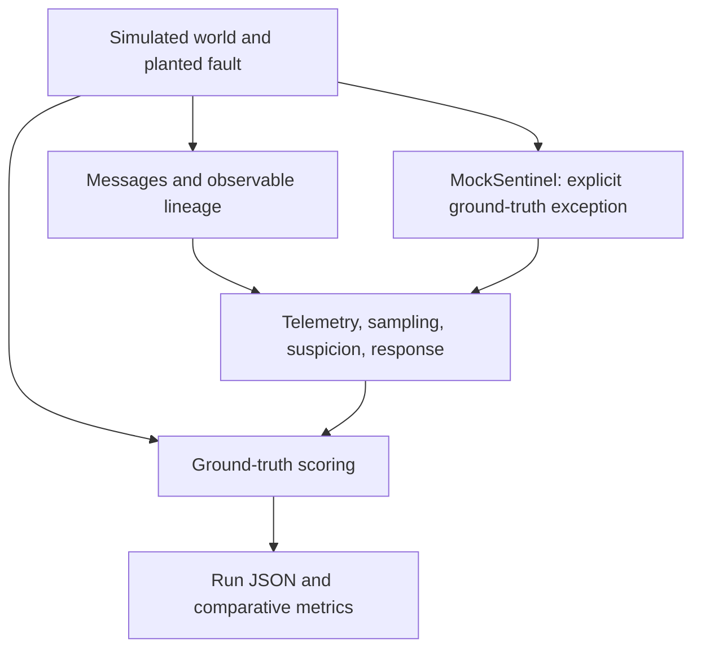

# Architecture

[← Project overview](../README.md) · [Methodology](METHODOLOGY.md) · [Run and inspect](RUNNING.md)

HARPY-SIM is a local batch simulation. HARPY-REPLAY is a separate local evaluation harness with a mechanical detector and an optional real model API adapter. Neither is a production control plane or web service. The implementation separates world generation, observable detector inputs, and ground-truth scoring.

## Oversight flow

The diagram shows the oversight-enabled arms. `NONE` bypasses oversight entirely; `TIER0_ONLY` uses mechanical signals without sentinel audits. The mock receives recent messages for each selected agent and generates an audit outcome from assumed detector characteristics.

## Experiment boundary

`Claim.is_corrupt` and `LineagePair.ground_truth` are guarded against access from oversight modules. `MockSentinel` is explicitly exempt because Phase 1 supplies detector performance as an input. The simulation uses ground truth to score outcomes, including missed detections and false isolations.

This guard catches accidental leakage in the experiment. It is not a security boundary against arbitrary Python code.

## A simulation tick

| Step | Behavior |
| --- | --- |
| Emit | Active simulated workers create messages; the world propagates faults and charges worker spend. |
| Observe | Tier 0 records mechanical signals, and the alert budget records active agent time. |
| Accumulate | Suspicion decays and incorporates Tier 0 scores. |
| Audit | The sampler accrues its allowance, selects affordable audits, and supplies outcomes to suspicion. |
| Gate | Suspicion uses the isolation threshold maintained by the alert budget. |
| Respond and score | Crossings trigger isolation; the controller flags descendants and attempts an alert. The world attributes true and false isolations and resets agent state as implemented. |

See [`run_simulation`](../src/harpy/simulation.py) and `_isolate` for the exact order and response sequence.

## Two independent budgets

| Budget | Mechanism | Evidence |
| --- | --- | --- |
| Dollars | Accrue a fraction of worker spend, subtract Tier 0 cost, and buy only affordable audits. | Audit counts and costs are recorded. |
| Human attention | Bound alerts per active agent-hour; optionally adapt the isolation threshold. | Suppressed alerts, effective threshold, and lost detections are scored. |

The cost ledger separates sentinel audits, Tier 0, discarded work, reruns, triage, and investigation. Four components always scale with worker-fleet size. The legacy `fixed` policy holds review cost constant; `linear` scales review with the fleet too. Both are accounting assumptions. Fleet scale and review policy are recorded in every v2 result.

## Five permitted controller actions

`isolate`, `halt_outbound`, `restart_clean`, `flag_downstream`, and `alert_human` are the controller's action surface. Not every action is invoked by the default simulation loop. A suppressed human alert is logged as `alert_suppressed`; it is the absence of an alert, not a sixth permitted action.

Downstream flagging traverses the observable lineage projection. Missing or spurious provenance can therefore change the response's reach.

## Sampling arms

| Arm | Audit policy |
| --- | --- |
| `NONE` | Unsupervised control: no oversight. |
| `TIER0_ONLY` | Mechanical checks and suspicion, with no sentinel audits. |
| `RANDOM` | Uniform random audits within the budget. |
| `DIRECTED` | Sampling weighted by Tier 0 scores; uniform fallback when all weights are zero. |
| `HYBRID` | A random reserve followed by directed sampling from the remaining allowance. |

Separate RNG streams keep a sampler change from reshuffling the simulated world used for comparison. Fleet-scale variants re-cost the same run because scale changes accounting rather than simulation dynamics.

## Outputs and next boundary

Each v2 run embeds the full configuration and pricing snapshot, hashes executing source and lockfiles, and records a shared experiment fingerprint. Sweeps write per-run JSON, a Parquet summary, and an artifact manifest. Baseline matching includes the experiment fingerprint and review policy; plotting refuses to combine different input identities, worker tiers, or detector assumptions.

`RealSentinel` serializes message observables explicitly and passes them to a detector without corruption labels. Replay validates a corpus's file hashes and separate label map. The detector receives one observation object; the scorer uses labels after predictions are recorded. This catches accidental answer leakage, but arbitrary Python code is not sandboxed.

`OpenAIResponsesDetector` calls the official Responses API with strict JSON output, no tools, and `store: false`. The requested model must match sourced pricing; the response must identify the same snapshot. Replay reserves a conservative token-cost bound before a call, records usage and provider hashes afterward, and stops on errors or unknown charges. A refusal or incomplete response is scored as a failed case rather than a negative detection.

The included replay corpus is a synthetic development fixture. Real traces, permissions, sanitization, and held-out evaluation remain necessary to measure real-world detector capability; see [the replay guide](REPLAY.md).

