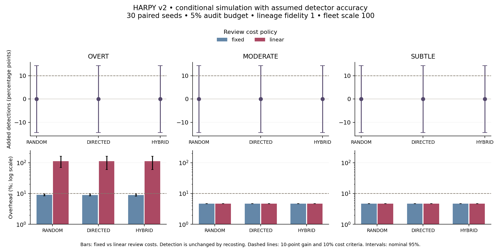

# V2 study: no demonstrated detection gain

[Project](../README.md) · [Methodology](METHODOLOGY.md) · [Run commands](RUNNING.md)

The frozen primary test is **INCONCLUSIVE**. HYBRID and its matched Tier 0 baseline each isolated the faulty agent in 0 of 30 SUBTLE runs. Mean overhead was 4.6979%. No observed incremental detection gain was demonstrated, so this study does not establish the success condition.

| Primary result | Estimate / nominal 95% interval |
| --- | --- |
| HYBRID detections | 0 / 30 |
| Tier 0 detections | 0 / 30 |
| Added detection probability | 0 percentage points; -14.34 to 14.34 points |
| Incremental overhead / worker cost | 4.6979%; 4.6966% to 4.6994% |
| False isolations and alerts | 0 in the primary cell |
| Decision | INCONCLUSIVE: cost clears the ceiling, but the detection interval does not establish a 10-point gain or rule it out. |

This is a conditional simulation using assumed detector accuracy. The narrow cost interval reflects seed variation under frozen prices and workload, not uncertainty in real staffing, future prices, model accuracy, or infrastructure costs. The zero-width paired bootstrap effect at zero successes is diagnostic; the decision uses a nondegenerate Wilson difference interval.

## Frozen design and source

The [specification](../configs/study.v2.yaml) was [committed before collecting study outcomes](https://github.com/MeLinResearch/Harpy/commit/1ea1409f0c007ed169d0b35849a1d59c97ff3f16). It defines a 10-percentage-point detection floor, a strictly below-10% cost ceiling, 30 paired seeds, and one primary cell. The primary uses HYBRID, SUBTLE, 5% audit budget, lineage fidelity 1, reserve 0.5, fleet scale 100, linear review, 0.05 alerts per agent-hour, and the gpt-4.1-mini pricing tier.

All five arms, three severities, two budgets, and two lineage fidelities produced 1,800 distinct simulations. Fixed/linear review and scales 1/100 re-cost those worlds into 7,200 records. They are not 7,200 independent trials. The fault distribution, thresholds, and detector assumptions in the v1 config were not tuned against these outcomes.

The source-content digest is `da351558f7adbcad85cc881185daa1ad8fc7ace788d351636445886e7358ddf0`; the complete input snapshot lists each source-file and lockfile hash. Git documentation and cross-platform checkout fixes after the frozen commit do not alter that executing Python source.

## Review-cost sensitivity

The figure fixes a 5% audit budget, lineage fidelity 1, reserve 0.5 for HYBRID, scale 100, and the same attention cap and prices as the primary. Added detection and cost intervals are shown separately; review recosting cannot change detections.

For OVERT/HYBRID, fixed review produces 8.93% overhead at scale 100; linear review produces 111.26%. Both have zero observed added detection over Tier 0 in this slice. This demonstrates the sensitivity to the accounting assumption, not measured review capacity. SUBTLE and MODERATE runs in this slice raised no reviews, so the policies agree there.

Across 144 exploratory cells, 42 receive FAIL and 102 INCONCLUSIVE; none receive PASS. These are exploratory classifications with no simultaneous-coverage claim. A new study may investigate more seeds, different workloads or allocation policies, and real detector traces, but it must freeze those choices before collecting outcomes.

## Published evidence

| Artifact | Purpose |
| --- | --- |
| [report.json](../evidence/study-v2/report.json) | Primary verdict, all exploratory cells, criteria, and uncertainty. |
| [preregistration.json](../evidence/study-v2/preregistration.json) | Specification and raw YAML hash written before collection. |
| [inputs.json](../evidence/study-v2/inputs.json) | Entire parsed simulation/pricing inputs, executing source hashes, and experiment fingerprint. |
| [seed-metrics.json.gz](../evidence/study-v2/seed-metrics.json.gz) | All 7,200 per-seed recosted metrics for recomputation. |
| [build.json](../evidence/study-v2/build.json) | Analysis Git revision, source identity, counts, and output license. |
| [manifest.json](../evidence/study-v2/manifest.json) | Trusted file-hash inventory and artifact parents; unsigned. |

`uv run python scripts/publish_study.py` recomputes the report from seed metrics before publishing the packet. [Reproduction commands](RUNNING.md) regenerate all per-run JSON and Parquet outputs; the compact packet omits those redundant raw files. Verify the packet with `uv run harpy verify --manifest evidence/study-v2/manifest.json`.

The [mechanical replay packet](../evidence/replay-reference/) separately records 6/7 detected planted faults and 0/5 false positives in a 12-case synthetic development fixture. Its Wilson intervals are broad (detection approximately 48.7–97.4%; false-positive rate 0–43.4%). It establishes neither held-out model performance nor real-trace accuracy. No real API key was available, and no live-model accuracy result was collected.
